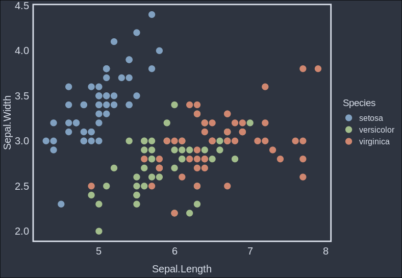
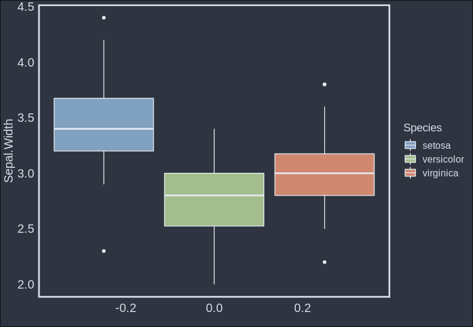
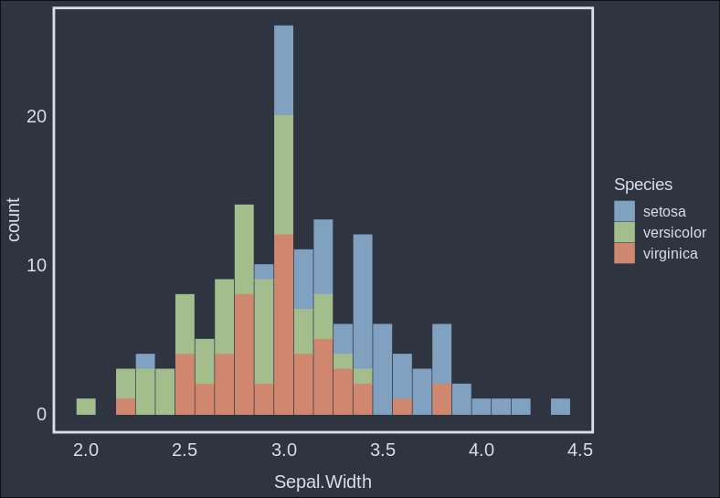
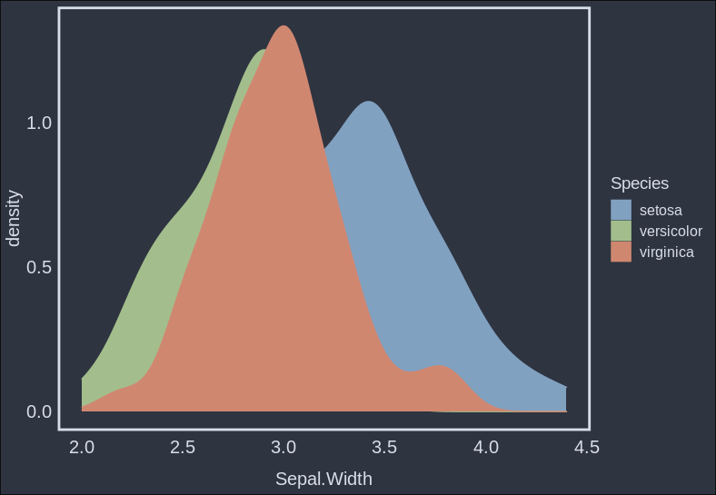
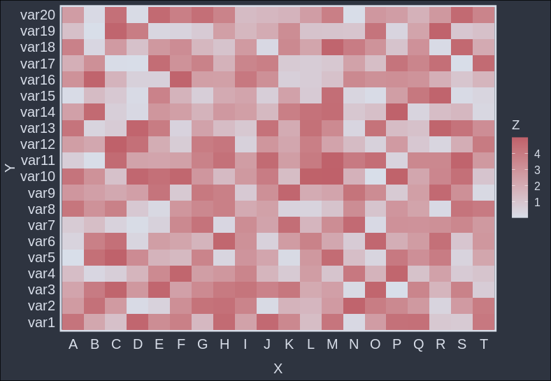

# `ggnord`: A theme for ggplot based on the [Nord color scheme](https://www.nordtheme.com/)

## Installation

```r
devtools::install_github("Hobbeist/ggnord", dependencies = TRUE)
```

## Usage Examples

```r
library(ggnord)
```

### Scatterplot  

```r
iris %>%
  ggplot(aes(x = Sepal.Length,
             y = Sepal.Width,
             color = Species)) +
  geom_point(size = 4) +
  theme_nord() +
  scale_color_nord() +
  scale_fill_nord()
```

  

### Boxplot

```r
iris %>%
  ggplot(aes(y = Sepal.Width,
             fill = Species)) +
  geom_boxplot(color = '#e5e9f0') +
  theme_nord() +
  scale_color_nord() +
  scale_fill_nord()
```

  

### Barplot

```r
iris %>%
  ggplot(aes(x = Sepal.Width,
             fill = Species,
             color = Species)) +
  geom_bar() +
  theme_nord() +
  scale_color_nord() +
  scale_fill_nord()
```

  

### Density plot

```r
iris %>%
  ggplot(aes(x = Sepal.Width,
             fill = Species,
             color = Species)) +
  geom_density() +
  theme_nord() +
  scale_color_nord() +
  scale_fill_nord()
```

  

### Heatmap

```r
# Dummy data
x <- LETTERS[1:20]
y <- paste0("var", seq(1,20))
data <- expand.grid(X=x, Y=y)
data$Z <- runif(400, 0, 5)

# Give extreme colors:
ggplot(data, aes(X, Y, fill= Z)) +
  geom_tile() +
  theme_nord() +
  scale_fill_gradient(low = '#d8dee9', high = '#bf616a')

```

  
